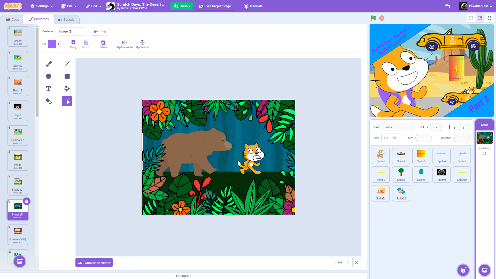
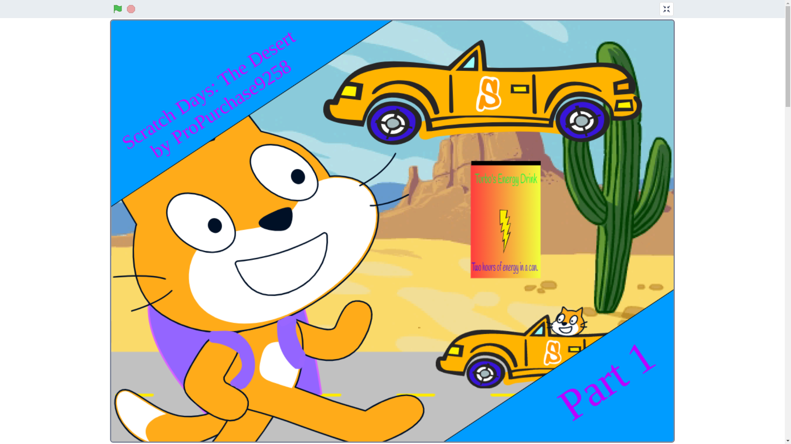
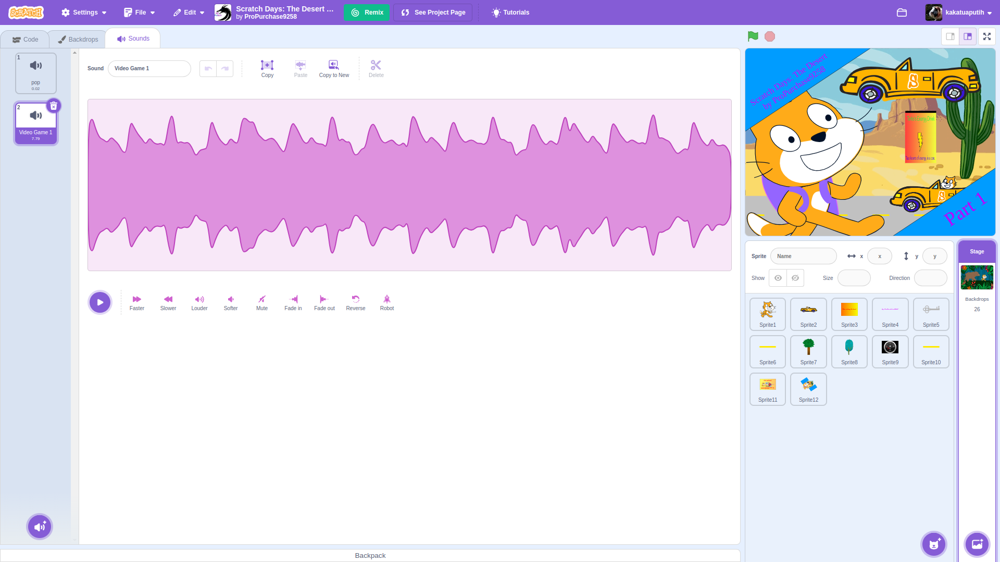
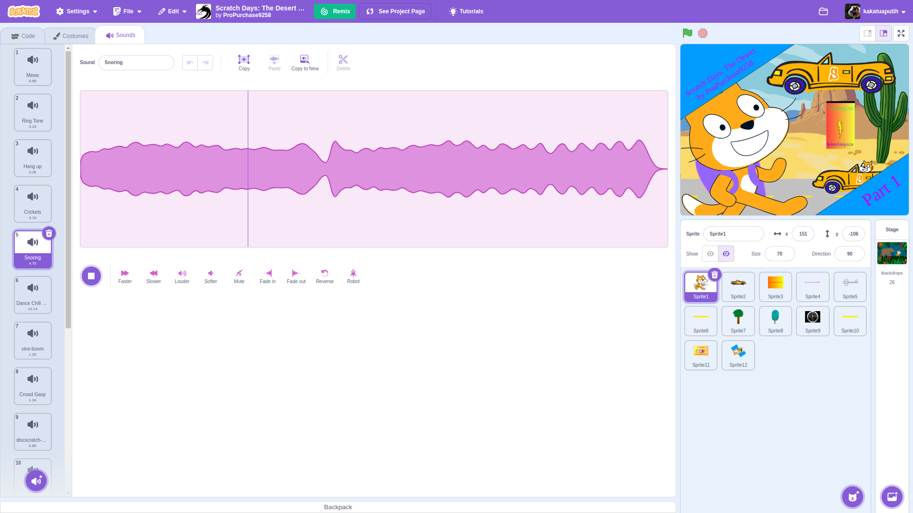

# [11] Collaborative work 101!

Hello everyone, may always be healthy. This meeting is our very first meet after Midterm Summative Test. So many projects that are very wonderful with its ideas and creativity. After doing that, we are targeting to do another Scratch 3.0 projects, but with more challenging target.

Let's dive in now!

```{figure} https://media3.giphy.com/media/v1.Y2lkPTc5MGI3NjExOWhwYjlqMzQ2ZWttcTV6OGRybnNyOWprYWJkNm96aHUzeng2OWJoMSZlcD12MV9pbnRlcm5hbF9naWZfYnlfaWQmY3Q9Zw/QYRPhhs5gsGKzRUf3W/giphy.webp
:label: gumball-bwaa
Bwaaaaaaaaa
```

---
## Wondering what and how to do? Check me
You may wonder how can we work with others more effectively. Doing it will bring great result because of our collaboration. Each person has its own task and responsibility. Before we distribute our responsibility, let's see what our friends (out of the world) do

```{figure} ../_static/images/content/11/the-desert.png
:label: The Desert Part 1 by ProPurchase9258
:alt: The Desert Part 1 by ProPurchase9258
:align: center

ProPurchase9258 made this with absolutely cool result! We should be able to do that too!

[Tap here to go to the project!](https://scratch.mit.edu/projects/1053129442/)
```

### 1. Backdrop Illustrator
```{figure}
:label: backdrops
:alt: What we see at the code for background
:align: center




```
The Backdrop Illustrator is the one who have significant ability on drawing some views or scenery at our story. It may be even drawing home interior, inside the car, or anything depending on the story.

He/She should be committed to draw anything directed from the Story Master.

### 2. Audio Composer
```{figure}
:label: backdrops
:alt: What we see at the code for background
:align: center




```

Everything we hear is Audio Composer responsibility! From the music that we hear along each section or different backdrops is arranged by the genius orchestration of the Composer. Including what sound will be heard when the character or object doing something and anything beyond that we can hear!

### 3. Story Master
```{figure} ../_static/images/content/11/story-master-1.png
:label: main-story
:alt: What he/she does is determining everything!
:align: center

Yes, the story is his legacy!
```
Story scenario is the most important thing at least it is along with the other components. Any inspiration should be given to the Story Master to craft the meaningful story

### 4. Character Creator
```{figure} ../_static/images/content/11/character-creator-1.png
:label: character
:alt: characters and objects in the story
:align: center

These are like dolls, controlled by code and interacts by story!
```

Story will not be completed without some characters in the story. This role is accompanying the Backdrop Illustrator to complete the story with good interaction and flow so it enhances the story!

### 5. Coding Elite
```{figure} ../_static/images/content/11/coding-elite-1.png
:label: coding-elite
:alt: it controls everything!
:align: center

Code is like magic, but logic!
```

The last thing, the Coding Elite will codes most of the story interaction including what the character does and the other objects done. Without the coding, story will be feel flat. So yes, a diligent and careful work will do its best to make the story fluent!

---
Yap, they are the 5 roles we will distribute for each of you. Make sure everyone is having their own role and get into its responsibility! Feel free to asks for mentoring from the teacher and discussing with others.

> Short story is easy to be authored but having short term enjoyment, but long story will be enjoyed in a long term with meaningful message behind it!

---
Great, let's fill these!

```{mermaid}
flowchart RL
  A(Story from 3B)
  B[Backdrop Illustrator] --> A
  C[Audio Composer] --> A
  D[Story Master] --> A
  E[Character Creator] --> A
  F[Coding Elite] --> A
```

And see ya on the next meeting!
