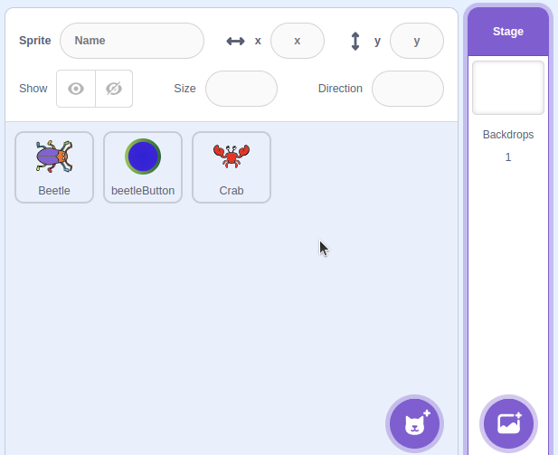
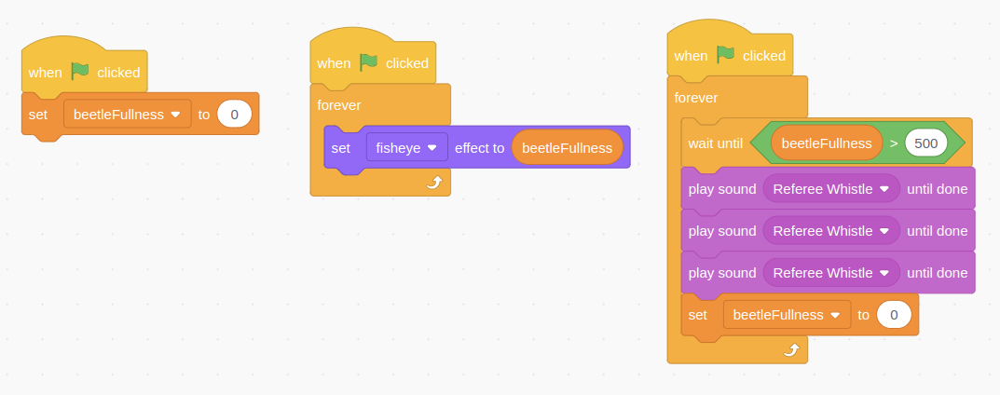
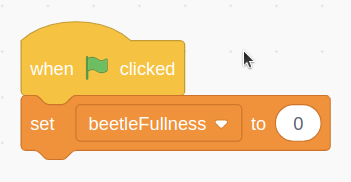
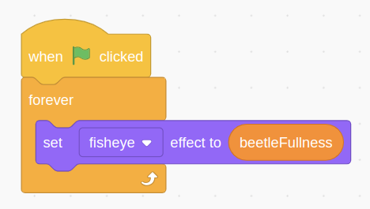
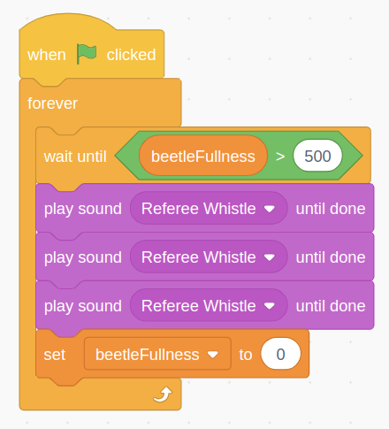
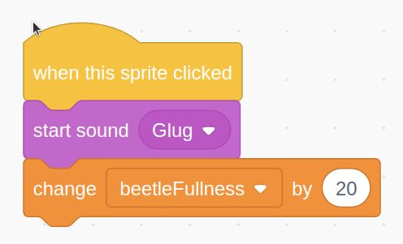
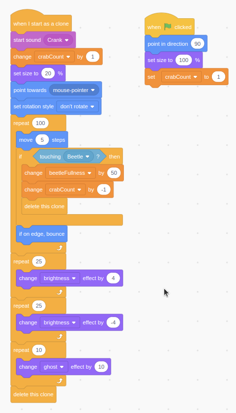
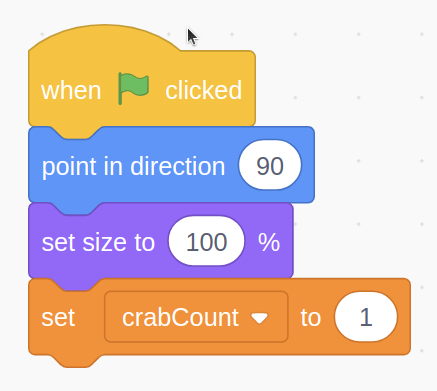
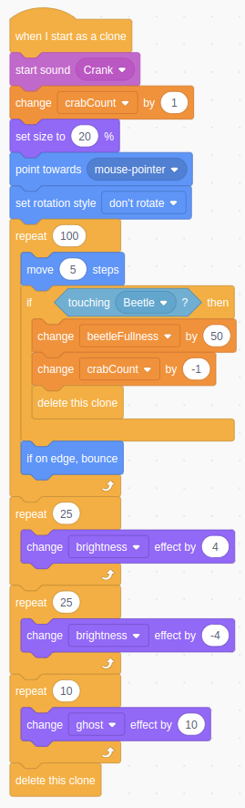

# [21] Touch Trigger

A little more steps to recreate something even better than the ReinGear's Deer Parallax. This time we are going to make our crab spawns its baby crabs!

---

## Feed the Beetle
:::{iframe} https://scratch.mit.edu/projects/1129982509/embed
I am hungry and I am **GIANT BEETLE**!
:::

The crab now do not have any buttons to be controlled with. It is utilizing our hand or mouse click to make it spawns its babies. But the beetle still use the same code as previous meeting does.

To not make it longer, let's code first!

## Preparation Code
First things first is we use our previous session code. For the one who have not complete it, do not worry! You may still follow these instructions.

:::{warning} Be Aware!
Please be aware with the existing code you have. Modify existing code into our new code today carefully
:::

We will have only 3 codes separated into 3 `sprites` here and some codes in `stage`. So here it is

## Let's Code the Puzzle!

:::{tip} 1. Stage Code
:class: dropdown
```{figure} ../_static/images/content/21/stage_code_01.png
:label: stage_code_21
:alt: Simple, two blocks only!



```

:::

In this stage code, `when stage clicked` is used to let the scratch know that the codes below it will run only when we give the input to the scratch screen. The input may be in form of mouse click or touch on to it. The code tells us it will create a clone of baby crab when the screen touched/clicked

:::{tip} 2. Beetle Codes
:class: dropdown
```{figure}
:label: beetle_codes
:alt: We have 3 codes for the Beetle






```

:::

We have 3 codes here. The first code is to initiate any value we needed right after everything started as precondition before interacting with the project.

In the first code, we need something to remember how full the beetle is. So as we start the project, it will set the beetle's fullness into 0.

Next code is needed to update the `fisheye` value as we want the beetle to be visually full. So we use `forever` block to monitor any update anytime. So it will update the visual fullness based on `beetleFullness` current value

The last code is for monitor the beetle when it is fully full. It will be cap to the 500 units and when the `beetleFullness` exceeds 500 units, it will play whistle sound three times consecutively and re-set the `beetleFullness` into 0 again

:::{tip} 3. Beetle Button Code
:class: dropdown
```{figure}
:label: beetle_btn_code
:alt: Simple code, isn't it?



```

:::

And then, this beetle button code only have not too many codes. When the button clicked, it will immediately play `Glug` sound and then increase the `beetleFullness` value by 20. It means that this button will "feed" the beetle manually.

:::{tip} 4. Crab Codes
:class: dropdown
```{figure}
:label: crab_codes
:alt: Long? Yes but this not long, they repeats





```

:::

And these are our final codes. We code the shorter one first. The short code means when we start the project, the crab should point horizontally and set its size to the original size. It also initialize the `crabCount` value into 1 as right in the start of the project, there is only one crab existing.

the `set size to x` block also keeps the crab size consistently to prevent any code resize the main crab. And the `point in direction x` will tell the direction where the baby crabs run.

At last, on the longer code. The code will start as a baby crab (parent crab clones). Every baby that spawns will start its unique sound and then increase the `crabCount` variable value by 1, set the clone into baby sized clone and then point to the `mouse-pointer` where ever the screen receive the input either clicks or touches. To make it sure it do not rotate the rotation, we set a block to disable rotation. *try with rotation if you need to know why (:.

The next part is we define how long baby crab moves toward the detemined direction by the input before and make sure if in any iteration it collides with the Beetle, it will disappear as if it is eaten by the Beetle. It will increase the `beetleFullness` and decrease the `crabCount` as it has been eaten and then delete the clone, forever! If it is not been eaten, it will run further and bounces of touching the edge of the screen.

The last parts are only for animation purposes and to make sure it will be deleted when having nothing to do left. So it will preserve the maximum clones below the max limit, 300 clones. It will blinks the baby crabs for a while and disappear

---
## Conclusion
Finally we have made the baby crabs spawn in where ever the direction is! So it will be easier for us rather to feed the Beetle or just having fun with the Baby Crab. Have some great experiments there and have a nice day!
